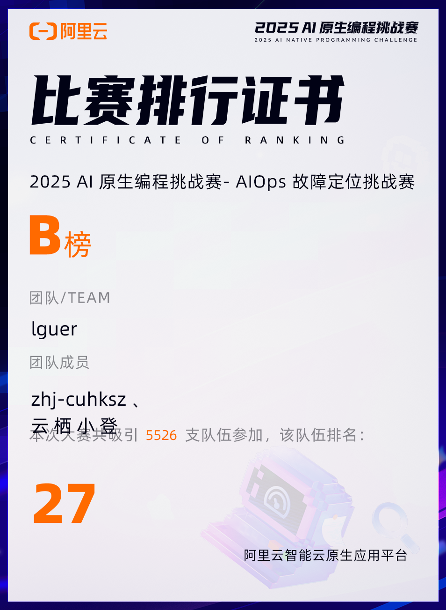

# LLM Agent 智能运维故障根因诊断项目

> 日期：2025-09-30
> 摘要：针对云原生环境下系统故障定位难、效率低的痛点，主导LLM Agent管线性能与准确率调优，通过Prompt优化、多智能体协作等策略，实现故障快速精准根因诊断，助力团队在5,000支队伍中斩获Top 0.5%的成绩。
> 技术栈：Python / PyTorch / Transformers / PEFT / LoRA 
> GitHub：https://github.com/Navy-Patrick/aliyun_Ai-ops

## 项目背景
随着云原生、AIGC等技术的快速革新，数字经济的影响力持续扩大，系统稳定性保障成为企业发展中无法回避的核心挑战，如何快速、准确定位系统故障，直接关系到系统可用性与业务连续性。与此同时，LLM凭借强大的推理能力，在运维领域的应用价值日益凸显，而多样的可观测数据（Log、Trace、Metric、Entity、Event）与开源事实标准，也让软件系统运行状况愈发透明。在此背景下，本次大赛提供真实云原生环境及多模态可观测数据，通过注入各类故障，要求选手借助AI技术，实现快速、准确、低成本的故障根因诊断，我们因此开展本项目，探索AI在AIOps场景的落地路径，解决故障定位痛点。

## 核心工作
1. Prompt Engineering深度优化，引入“资源优先”“相对指标强制”“SOP约束”核心诊断规则，引导模型精准区分表层症状与底层根因，提升诊断准确率。
2. 落地多角色智能体协作方案，设计并调试数据分析师、系统专家、验证专家的协作流程与信息传递机制，有效降低单一模型的“幻觉”风险。
3. 实现上下文管理与性能优化策略，通过动态摘要、上下文步数限制、早停机制，平衡故障诊断深度与Token消耗，提升管线运行效率。
 

## 难点处理
- 针对**单一模型幻觉风险高**的问题，通过多角色交叉验证机制，让验证专家对诊断结果进行二次校验，结合可观测数据反向验证推理逻辑；
- 针对**诊断深度与Token消耗**的平衡难题，通过大量实验调试动态摘要阈值、上下文步数上限及早停条件，找到最优参数组合；

- 比赛链接：[比赛官方链接](https://tianchi.aliyun.com/competition/entrance/532387)