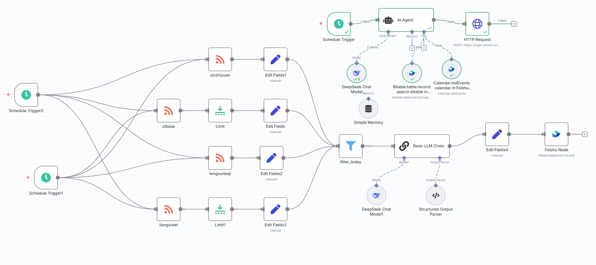
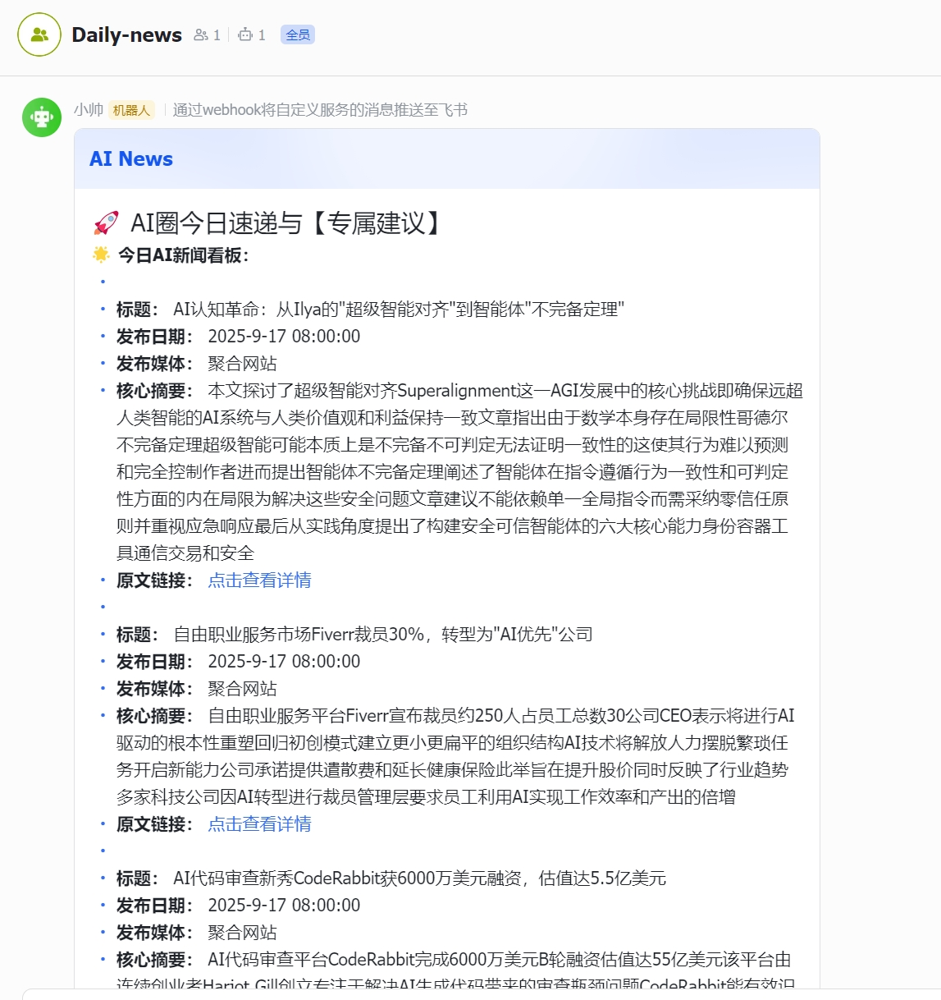

# AI Agent + n8n 每日新闻推送

> 日期：2025-09-17
> 摘要：用低代码搭建一个能自动看新闻、排日程、每日推送到手机的专属智能助手，全程无代码 / 低代码可复现。
> 技术栈：Python / Node.js / Docker

## 项目定位

- 项目名称：每日新闻 + 日程智能 Agent（n8n 版）
- 核心能力：自动抓取新闻 → AI 总结 → 生成日程 → 定时推送到手机
- 面向人群：零基础，不用写复杂代码，拖拽节点即可搭建。

## 完整工作流（6 步）

1. 定时触发（Cron Trigger）
   设定每天固定时间（如早 8 点）自动启动流程。
2. 新闻数据源抓取
   通过 RSS / 网页接口拉取指定领域新闻（科技 / 行业 / 热点）。
3. AI 智能处理
   大模型提炼要点、去重、过滤、生成精简摘要。
4. 日程自动编排
   按重要性 / 时间生成可读日程清单，结构化输出。
5. 消息格式化
   整理成手机友好的文本 / 卡片样式。
6. 手机端推送
   发到微信、邮箱、飞书、企业微信等，手机实时接收。

## 一句话总结

@@hero 这是一个用 n8n+AI 做的个人自动化助手，帮你每天自动排日程，搜集新闻。

