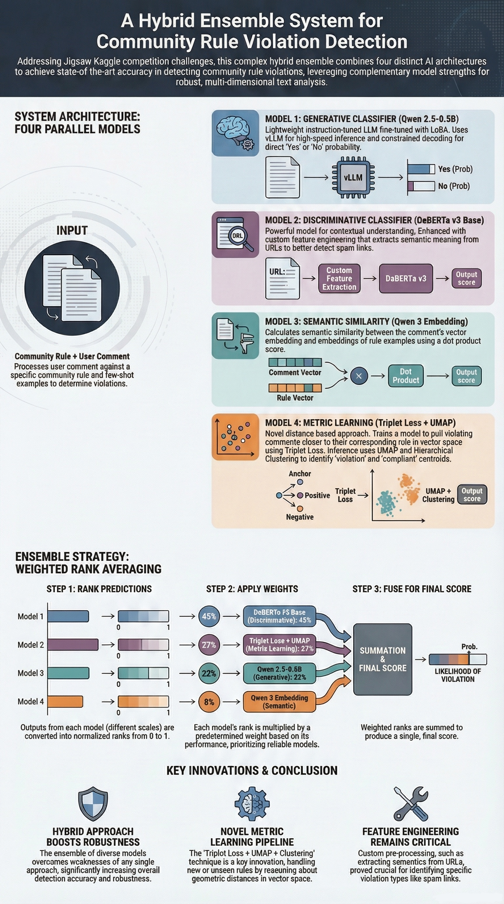

# Jigsaw – Agile Community Rules Classification

> 日期：2025-10-26
> 摘要：基于社区规则与帖子语义的二分类任务，通过语义向量与轻量结构化特征结合，识别帖子是否违反规则，兼顾效果与可复现性。
> 技术栈：Python / Pandas / Scikit-learn / LightGBM / Qwen3-Embedding-0.6B / Kaggle
> GitHub：https://github.com/Navy-Patrick/jigsaw-agile-community-rules-classification

## 项目核心内容

本项目围绕 Kaggle 竞赛 `Jigsaw – Agile Community Rules Classification` 展开，目标是判断一条社区帖子是否违反给定规则。
项目采用“语义理解 + 结构化特征”结合的方案，而不是只依赖单一模型。整体流程包括：
- 对 `body`、`rule` 以及正负样本示例文本进行统一清洗与拼接
- 提取文本长度、词汇重叠、相似度等轻量特征
- 使用 `Qwen3-Embedding-0.6B` 获取语义向量，增强模型对复杂表达的理解能力
- 使用 `LightGBM` 完成最终的二分类预测
- 输出可直接提交到 Kaggle 的 `submission.csv`

## 解决的问题

这个项目主要解决以下几个问题：

1. **规则表达抽象，不能只靠关键词判断**  
   社区规则往往描述得比较宽泛，很多违规内容并不会直接出现敏感词，因此需要模型具备更强的语义理解能力。

2. **存在大量难例和边界样本**  
   有些帖子表面上看起来正常，但结合规则后其实违规；也有些帖子语气激烈，但并不违反规则。项目通过语义向量和统计特征结合，提升对这类样本的识别能力。

3. **训练环境资源有限**  
   Kaggle Notebook 的运行时间和算力有限，不能依赖过于复杂的训练流程，因此项目采用轻量、稳定、可离线运行的方案。

总结来说，这个项目的目标是：在资源有限的条件下，把社区规则理解任务做成一个**可运行、可复现、兼顾效果与效率**的完整 NLP 分类方案。

