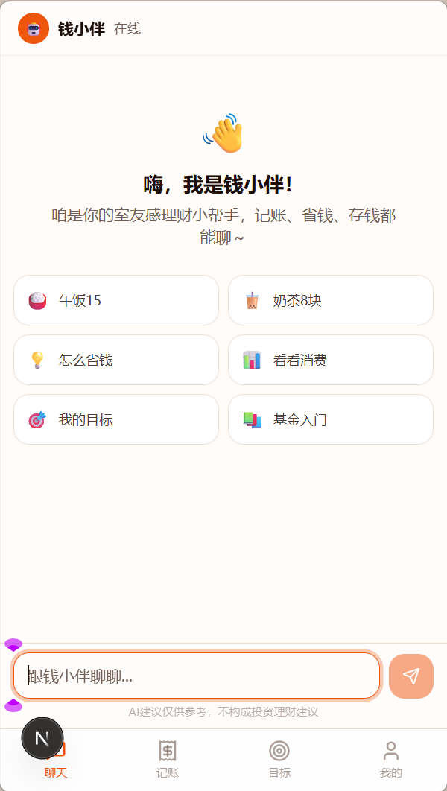
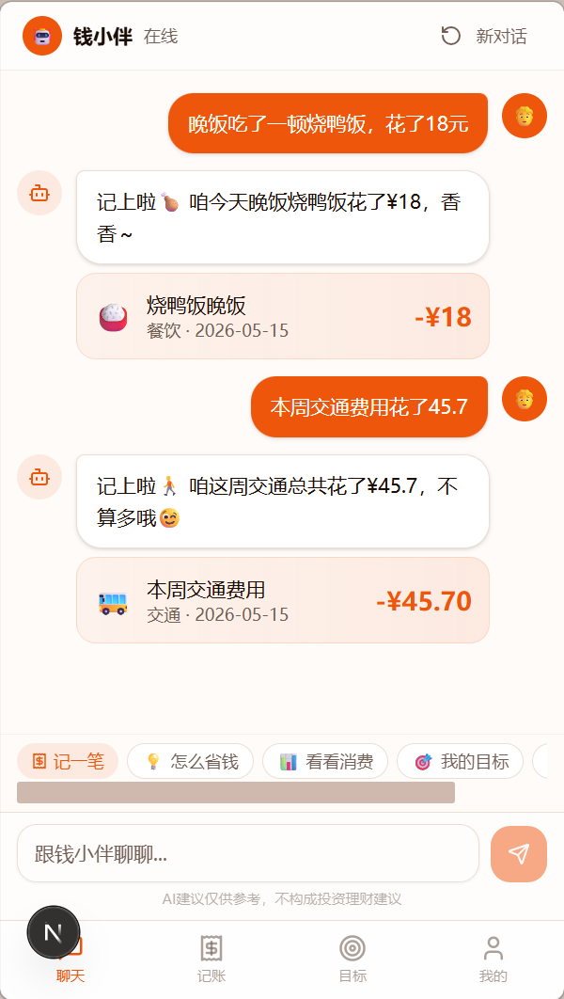
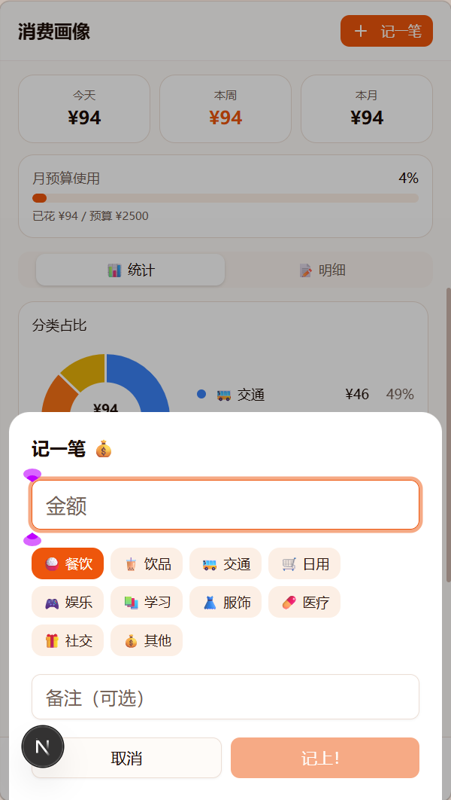
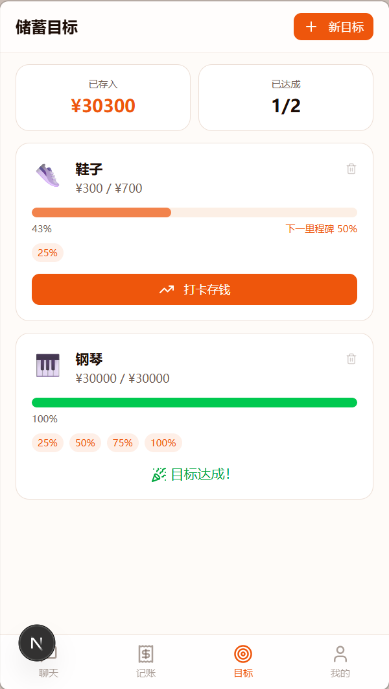

# 钱小伴 AI Financial Companion

> 日期：2026-05-15
> 摘要：面向大学生的理财陪伴型 AI 智能体，围绕记账、预算管理、消费复盘、储蓄目标与理财科普构建轻量闭环，帮助用户从“会记账”逐步过渡到“会管钱”。
> 技术栈：Next.js / TypeScript / React / Tailwind CSS / shadcn/ui / SSE / localStorage
> GitHub：https://github.com/Navy-Patrick/Wealth-AI-Assistant

## 项目定位

“钱小伴”是一款面向大学生的室友型理财陪伴 AI，不是传统理财工具，而是一个具有人设感、陪伴感和轻量决策辅助能力的财务搭子。

## 项目核心内容

- **对话式记账**：用户用自然语言即可完成记账、修改和删除，降低手动记录门槛。
- **消费画像与周报**：自动汇总消费结构与变化趋势，帮助用户看懂钱花去了哪里。
- **储蓄目标打卡**：通过进度条和里程碑机制，让攒钱过程更可视化、更容易坚持。
- **场景化理财微课**：围绕基金、余额宝、定投等基础概念做轻量科普，降低入门成本。
- **冲动消费拦截**：在大额消费前给出预算影响与温和提醒，帮助用户冷静决策。

## 解决的问题

这个项目主要解决大学生日常财务管理中的几个核心痛点：

1. **记账门槛高**：手动记账步骤多，容易中断。
2. **预算感知弱**：花钱时很难实时意识到剩余预算。
3. **消费复盘缺失**：知道花了钱，但不知道花在哪、是否合理。
4. **储蓄缺乏激励**：存钱目标难坚持，缺少阶段性反馈。
5. **理财认知不足**：对基础理财概念有兴趣，但缺少入门路径。
6. **冲动消费频繁**：遇到大额支出时缺少及时提醒和冷静期机制。

## 界面展示

## 项目链接

- 体验链接：[在线体验地址](https://q3yhywnmd2.coze.site/)
- PDF：[产品说明书](./Qian_Xiaoban_AI_Financial_Companion.pdf)

