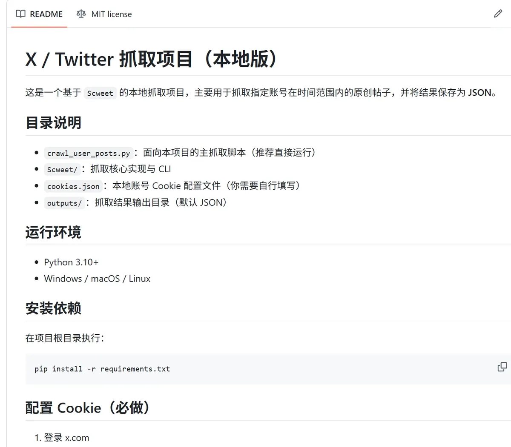

# X / Twitter 数据采集器（本地版）

> 日期：2025-06-07
> 摘要：面向指定账号与时间区间的推文采集工具，基于 Scweet 实现本地稳定抓取，统一输出 JSON，方便后续分析与可视化。
> 技术栈：Python / Scweet / Requests / JSON / CLI
> GitHub：https://github.com/Navy-Patrick/twitter-x-scraper

## 项目背景

这个项目要解决的是：在不依赖官方 API 的前提下，如何稳定抓取指定账号在特定时间范围内的原创内容，并沉淀为可复用的数据资产。

## 核心能力

1. **账号定向抓取**：支持按用户名列表批量抓取，便于长期跟踪。

2. **时间窗口控制**：支持 `SINCE/UNTIL` 精确筛选，降低无效数据噪声。

3. **统一 JSON 输出**：结果结构一致，便于后续分析、建模和看板展示。

GitHub：[项目仓库地址](https://github.com/Navy-Patrick/twitter-x-scraper)
