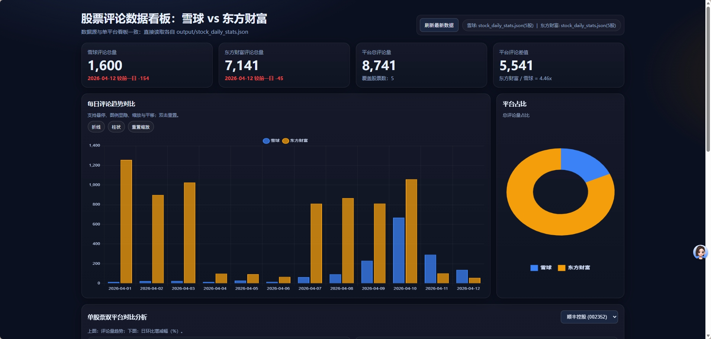
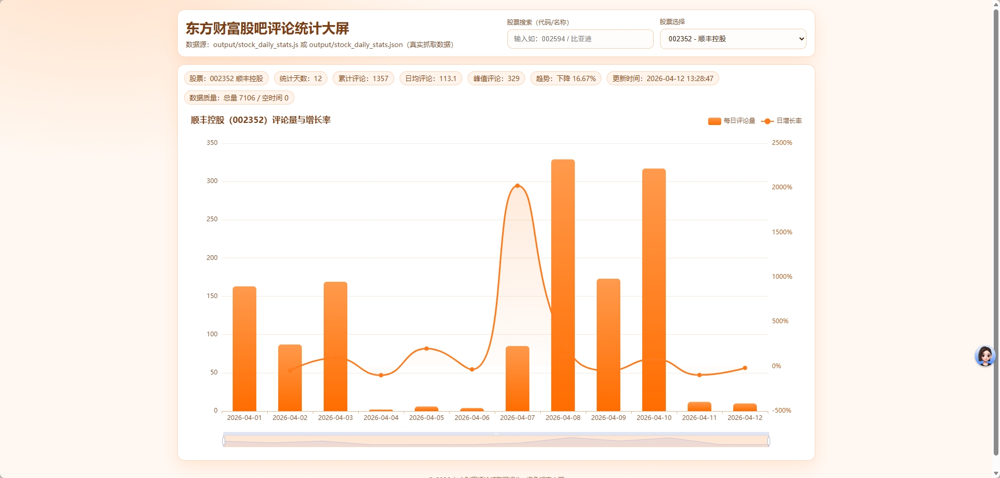
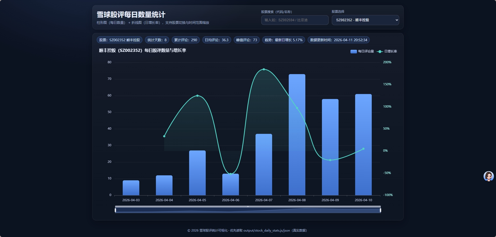
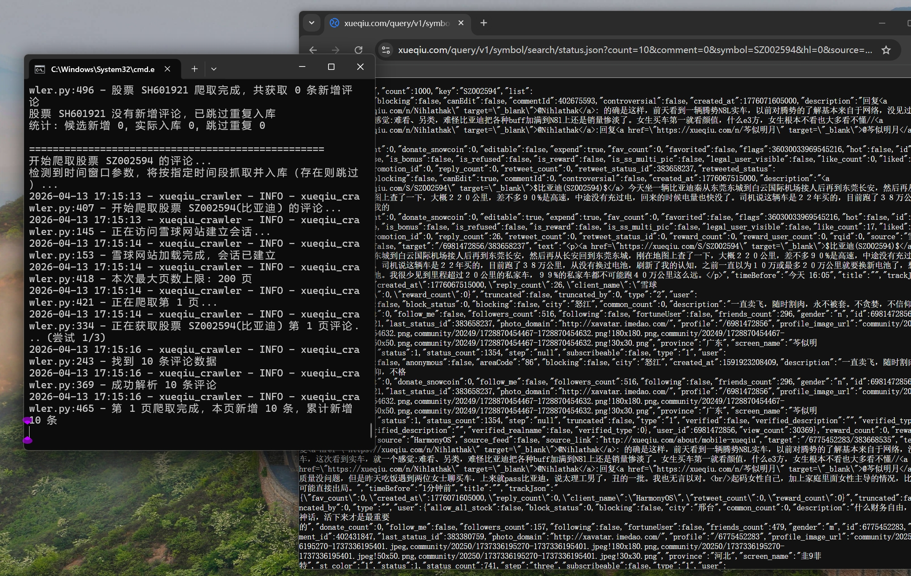

# Dual Platform Crawler：股票双平台内容爬虫看板

> 日期：2026-04-10
> 摘要：一个面向雪球 + 东方财富的双平台股票评论爬虫项目，支持分页抓取、本地数据库存取、每日评论统计导出、双平台看板与图表交互。
> 技术栈：Python / Requests / BeautifulSoup / Database / CLI
> GitHub：https://github.com/Navy-Patrick/dual-platform-crawler

## 项目价值

该双平台情绪数据看板的核心价值在于：将市场**主观情绪进行量化观察**，为投资者提供客观、多维度的参考依据。

### 1）减少单一平台偏见
- 雪球（偏价值投资）与东方财富（偏短线交易）用户画像差异明显
- 通过双平台融合，形成“长期价值情绪 + 短期交易情绪”的互补视角
- 降低单一社区带来的情绪误判风险

### 2）降低情绪化决策
- 历史评论数据可视化后，抽象“情绪”变成可追溯、可比较的曲线
- 便于识别情绪过热 / 过冷的阶段性拐点
- 为买卖节奏提供理性参考，减少盲目跟风

### 3）支持个性化跟踪
- 可聚焦“特定股票”进行持续情绪观测
- 更贴近持仓与关注标的，而非泛化市场噪声
- 有利于形成个人化的情绪研究框架

## 一句话总结

这是一个将“舆论热度”转化为“结构化情绪信号”的实用项目，目标不是预测市场，而是帮助投资者在噪声中提高判断质量。
---

## 界面展示

---

