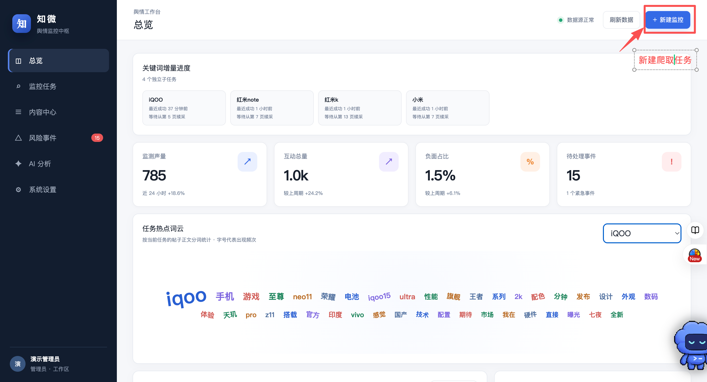
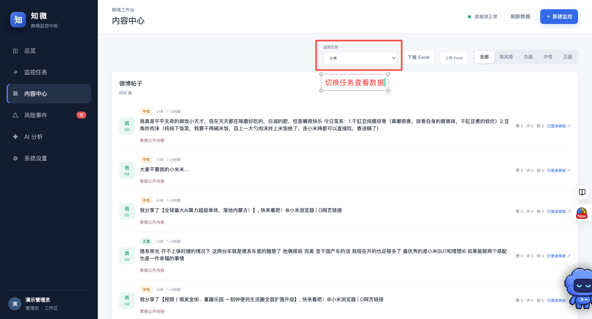
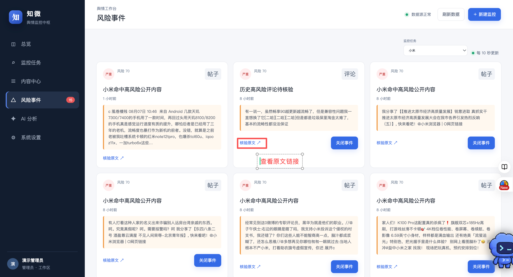

# 知微：微博舆情监控与分析工作台

@@hero 输入关键词，捕捉舆情变化——从微博采集、风险发现到 AI 研判，一个工作台完成闭环。

## 一眼看懂

知微是一套面向非技术用户的本机微博舆情工具。它把零散的帖子与评论转化为可追踪的趋势、风险事件和分析结论，让热点不只被“看见”，更能被理解和核验。

## 核心能力

- **持续监控**：一个任务管理多个关键词，支持增量采集与周期调度。
- **风险预警**：结合情感与风险评分，从海量内容中快速定位异常信号。
- **AI 研判**：兼容 DeepSeek 等模型接口，自动生成任务级舆情分析。
- **数据闭环**：帖子、评论、趋势、词云、事件及 Excel 导入导出集中管理。

## 技术亮点

项目采用“可见浏览器采集 + 本地采集器 + Web 工作台 + 离线分析任务”架构。Node.js 通过 Chrome CDP 采集账号正常可见的公开内容，Python 完成离线分析与队列处理，SQLite 保存本机业务数据。

增量游标、幂等去重、断网续传和评论缓存共同保障采集稳定性；微博 Cookie 仅保存在独立 Chrome 用户目录中，不上传业务数据库。

## 使用边界

仅采集账号正常可见的公开内容；风险评分与 AI 研判用于辅助决策，重要结论仍需结合原文人工核验。

GitHub：[项目仓库地址](https://github.com/Navy-Patrick/weibo-2/tree/main)
